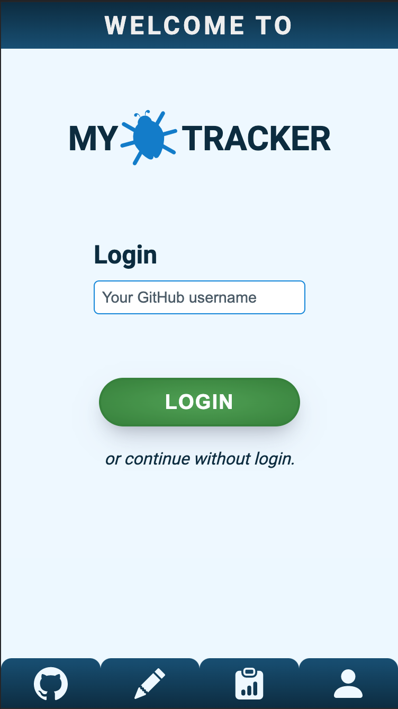
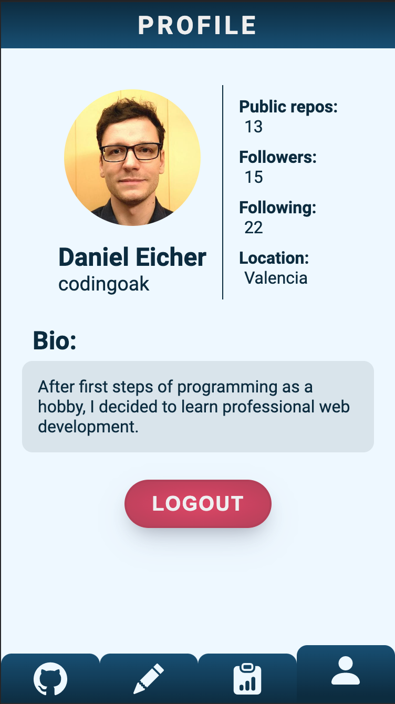
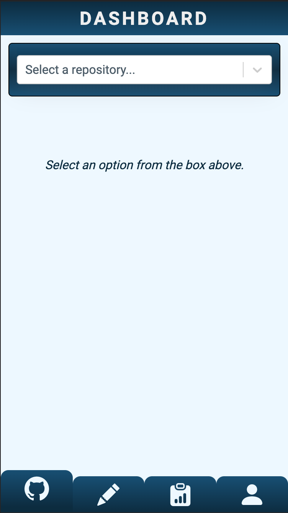
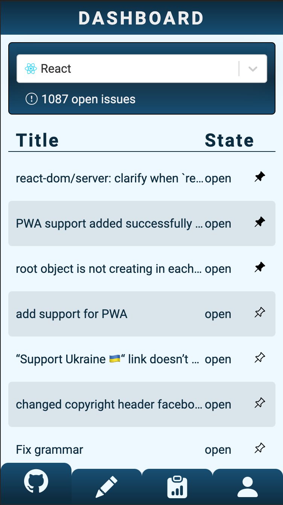
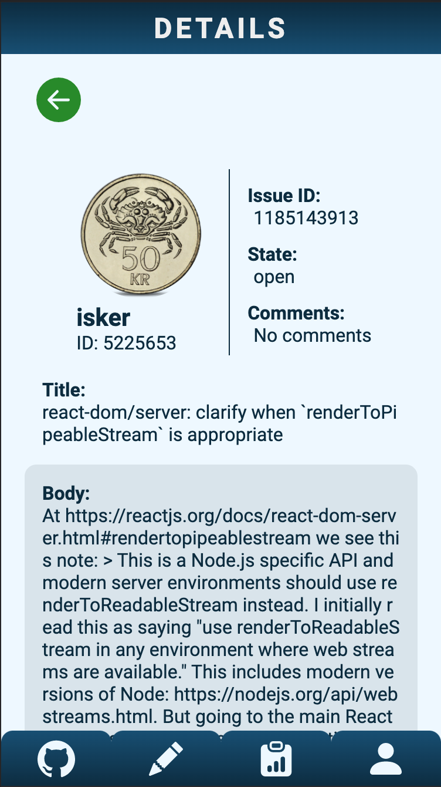
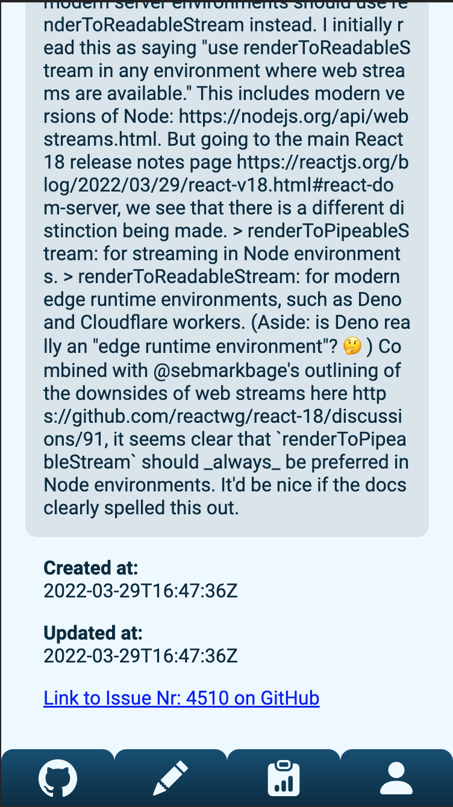
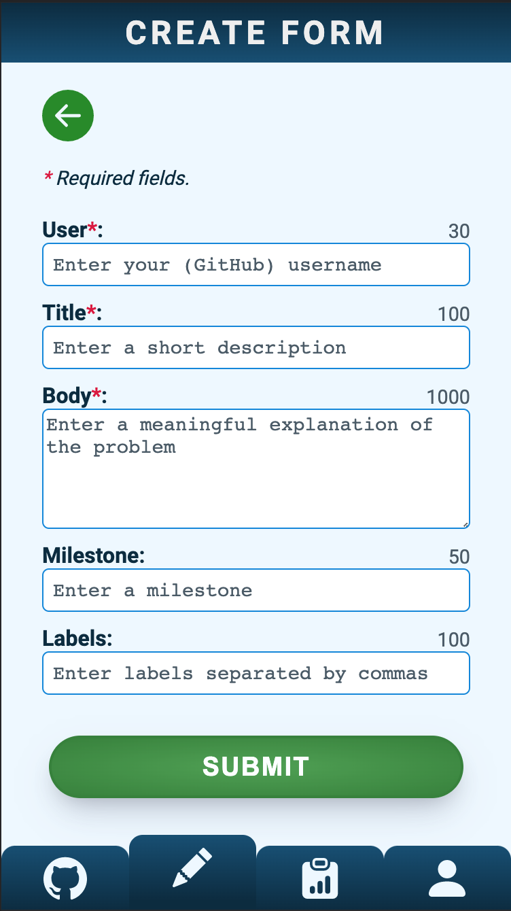
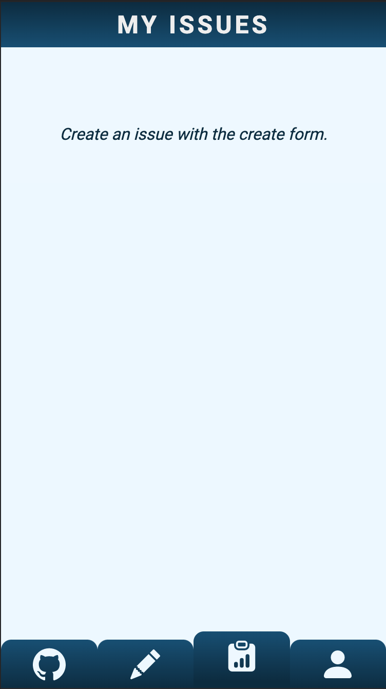

# Capstone Project: MyTracker (in progress..)

## Desription

App for tracking issues. With mytracker, issues can be loaded from selected GitHub repositories. By logging in with a GitHub username, you get the public data on the profile page. The dashboard shows an overview of the open issues that you can scroll through. The issues can be saved by pinning them to local storage and then appear at the top of the respective page. You can also create, edit and delete your own issues, wich appears in a separate list.

You can choose between four different projects:

- Angular
- Babel
- ESLint
- Express
- Git
- Node.js
- React
- React Testing Library
- Sass
- Styled Components
- Vue.js

## Tech Stack

- React
- React Router
- react-select
- React Hooks
- React-Hook-Form
- styled-components
- Storybook
- Testing-Library
- Framer Motion

## Installation

- Clone the repository
- Install dependencies: `npm i`
- Run app in dev mode: `npm start`
- Run tests: `npm run test`
- Run Storybook: `npm run storybook`
