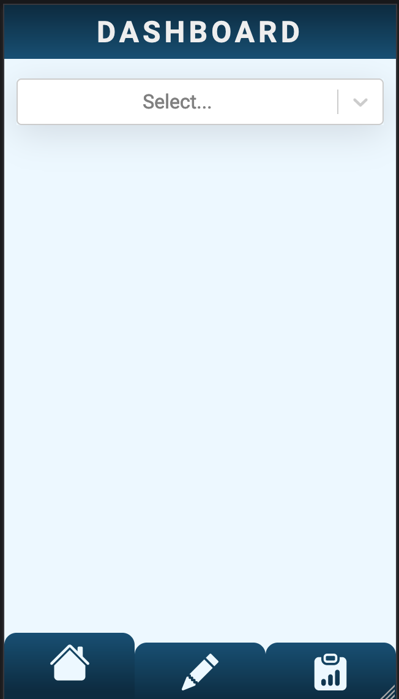
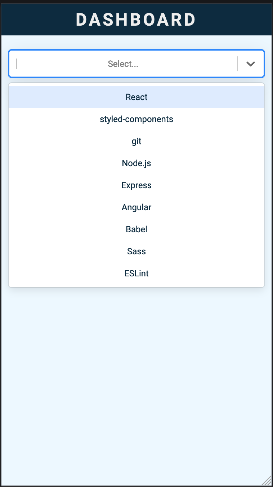
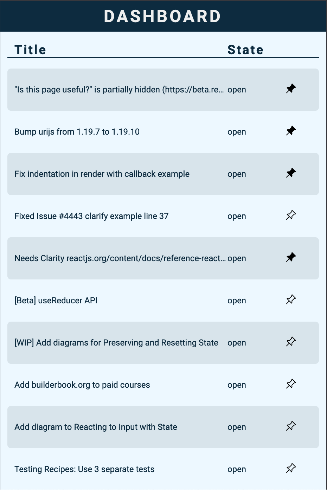
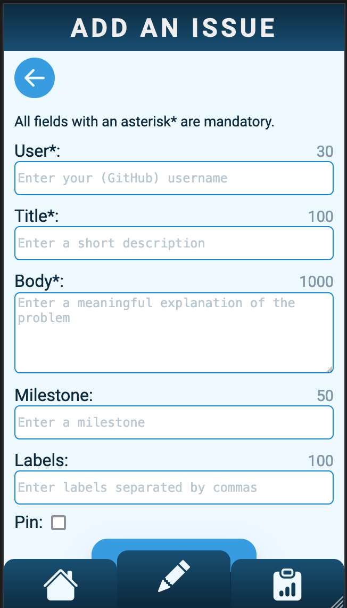

# Capstone Project: MyTracker

## Desription

App for tracking react issues. MyTracker fetches data on GitHub. A dashboard shows an overview of the latest issues and the individual issues can be pinned. The data is stored in local storage.

You can choose between four different projects:

- React
- Styled-components
- Git
- Node.js
- Express.js
- Angular
- Babel
- Sass
- ESLint

It is also possible to create and delete your own issue, wich appears in a separate list.

## Tech Stack

- React
- styled-components
- react-select
- react-router
- react-hook-form
- Storybook

## Installation

- Clone the repository
- Install dependencies: `npm i`
